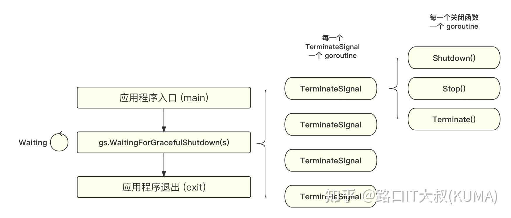

# Quick Start

`GS` is very simple, less code and easy to use. Just create `TerminateSignal` instances, register the resources which want to be closed when the service is terminated, and use `WaitingForGracefulShutdown` method to wait for the `TerminateSignal` instances to shutdown gracefully.

author: github.com/shengyanli1982/gs

## 架构设计
整个结构也非常简单，只有两个模块，一个是 TerminateSignal，一个是 WaitingUnit。 主打就是：“轻量、易用、快速”


## 模块介绍
1. 关闭信号 (TerminateSignal)
   TerminateSignal 是一个结构体，它的主要功能就是注册需要取消的回调函数，然后等待关闭信号的到来，执行注册的回调函数。 同时 TerminateSignal 提供 Timeout 的机制，可以设置超时时间，超时之后，会强制执行注册的回调函数。也支持传入外部 ctx.Context 来与外部逻辑同步，当 ctx.Context 被取消的时候，也会强制执行注册的回调函数。

TerminateSignal 可以通过 CancelCallbacksRegistry 方法来注册需要取消的回调函数，也就是说一个 TerminateSignal 可以控制多个对象的优雅关闭。

也可以通过 GetStopCtx 方法来获取关闭信号的 Context。

2. 守护器 (WaitingUnit)
   WaitingUnit 只有一个功能，等待所有的关闭信号执行完注册的关闭函数，然后退出。 它是一个阻塞函数，只有当所有的关闭信号都执行完成之后，才会返回。 WaitingUnit 通过相应进程的终结信号（SIGINT/SIGTERM/SIGQUIT）来触发所有的关闭信号执行。 属于事件驱动型的设计。

一个 WaitingUnit 可以控制多个 TerminateSignal 实例，也就是说一个 WaitingUnit 可以控制多个对象的优雅关闭。


### Methods

**Create**

-   `NewTerminateSignal` : Create a new `TerminateSignal` instance
-   `NewDefaultTerminateSignal` : Create a new `TerminateSignal` instance with default signals
-   `NewTerminateSignalWithContext` : Create a new `TerminateSignal` instance with context

> [!TIP]
> The `InfinityTerminateTimeout` value is used to set the timeout signal to infinity. It means that the `TerminateSignal` instance will not be closed until `Close` method is called and the resources registered in the `TerminateSignal` instance are closed.

**TerminateSignal**

-   `RegisterCancelCallback` : Register the resources which want to be closed when the service is terminated
-   `GetStopContext` : Get the context of the `TerminateSignal` instance
-   `Close` : Close the `TerminateSignal` instance

**Waiting**

-   `WaitingForGracefulShutdown` : Use this method to wait for all `TerminateSignal` instances to shutdown gracefully

### Example

```go
package main

import (
	"fmt"
	"os"
	"time"

	"github.com/shengyanli1982/gs"
)

// simulate a service
type testTerminateSignal struct{}

func (t *testTerminateSignal) Close() {
	fmt.Println("testTerminateSignal.Close()")
}

// simulate a service
type testTerminateSignal2 struct{}

func (t *testTerminateSignal2) Shutdown() {
	fmt.Println("testTerminateSignal2.Shutdown()")
}

// simulate a service
type testTerminateSignal3 struct{}

func (t *testTerminateSignal3) Terminate() {
	fmt.Println("testTerminateSignal3.Terminate()")
}

func main() {
	// Create TerminateSignal instance
	s := gs.NewDefaultTerminateSignal()

	// create resources which want to be closed when the service is terminated
	t1 := &testTerminateSignal{}
	t2 := &testTerminateSignal2{}
	t3 := &testTerminateSignal3{}

	// Register the close method of the resource which want to be closed when the service is terminated
	s.RegisterCancelCallback(tts.Close)

	// Create a goroutine to send a signal to the process after 2 seconds
	go func() {
		time.Sleep(2 * time.Second)
		p, err := os.FindProcess(os.Getpid())
		if err != nil {
			fmt.Println(err.Error())
		}
		err = p.Signal(os.Interrupt)
		if err != nil {
			fmt.Println(err.Error())
		}
	}()

	// Use WaitingForGracefulShutdown method to wait for the TerminateSignal instance to shutdown gracefully
	gs.WaitingForGracefulShutdown(s)

	fmt.Println("shutdown gracefully")
}
```

**Result**

```bash
# go run main.go
testTerminateSignal3.Terminate()
testTerminateSignal.Close()
testTerminateSignal2.Shutdown()
shutdown gracefully
```

# Features

`GS` provides features not many but enough for most services.

## Timeout Signal

`TerminateSignal` instance can be created with a timeout signal. When the timeout signal is received, the `TerminateSignal` instance will be closed not waiting for resources registered in the `TerminateSignal` instance will be closed.

> [!TIP]
> The **Timeout** can fix the problem that the service cannot be closed due to the resource cannot be closed. But it is not recommended to use timeout signal, because it may cause the resource to be closed abnormally.

### Example

```go
package main

// simulate a service
type testTerminateSignal struct{}

func (t *testTerminateSignal) Close() {
	time.Sleep(5 * time.Second)
}

func main() {
	// Create TerminateSignal instance
	s := gs.NewTerminateSignal(time.Second)  // timeout signal is set to 1 second

	// create a resource which want to be closed when the service is terminated
	t1 := &testTerminateSignal{}

	s.RegisterCancelCallback(tts.Close)

	// Create a goroutine to send a signal to the process after 2 seconds
	go func() {
		time.Sleep(2 * time.Second)
		p, err := os.FindProcess(os.Getpid())
		if err != nil {
			fmt.Println(err.Error())
		}
		err = p.Signal(os.Interrupt)
		if err != nil {
			fmt.Println(err.Error())
		}
	}()

	// Use WaitingForGracefulShutdown method to wait for the TerminateSignal instance to shutdown gracefully
	gs.WaitingForGracefulShutdown(s)

	fmt.Println("shutdown gracefully")
}
```


